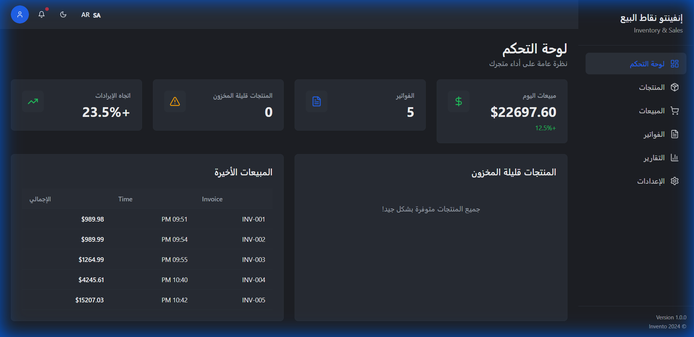
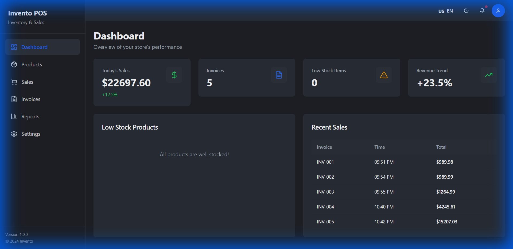
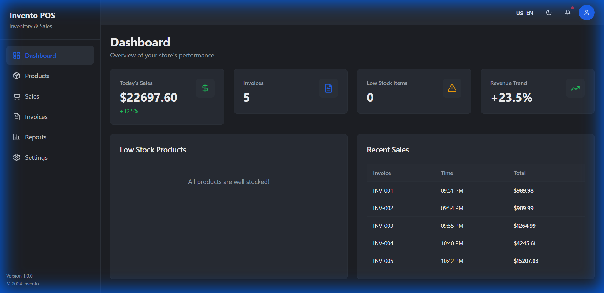
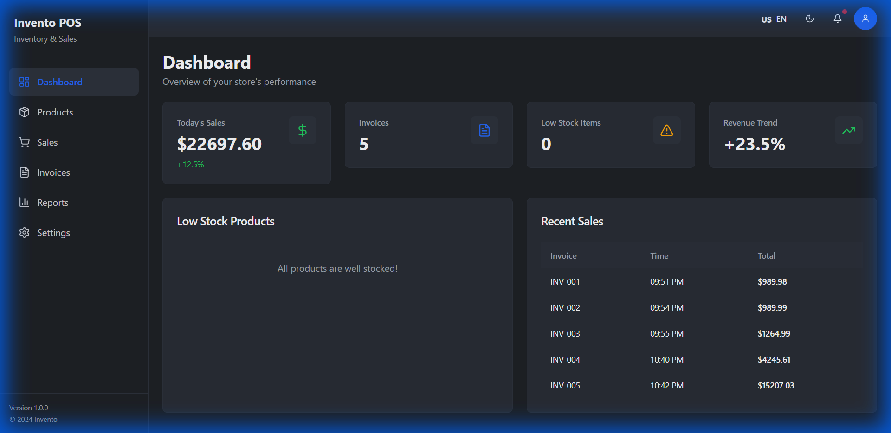

<div align="center">

# 🏪 Invento POS - نظام نقاط البيع الاحترافي

### Point of Sale & Inventory Management System

### نظام متكامل لإدارة المبيعات والمخزون

[](https://reactjs.org/)
[](https://www.typescriptlang.org/)
[](https://tailwindcss.com/)
[](https://vitejs.dev/)
[](LICENSE)

<p align="center">
  
</p>

**[English](#english)** | **[العربية](#arabic)**

</div>

---

<a name="english"></a>

## 🌟 Features

### ✨ Core Functionalities

- 📊 **Real-time Dashboard** - Live analytics and KPIs
- 🛒 **Point of Sale** - Fast and intuitive sales interface
- 📦 **Inventory Management** - Track stock levels and products
- 🧾 **Invoice Management** - Generate and print receipts
- 📈 **Reports & Analytics** - Daily sales reports and insights
- 👥 **Multi-user Support** - Role-based access control (planned)

### 🎨 User Experience

- 🌐 **Bilingual Support** - Full Arabic/English with RTL/LTR
- 🌓 **Dark/Light Mode** - Eye-friendly themes
- 📱 **Fully Responsive** - Works on all devices (Mobile, Tablet, Desktop)
- ⚡ **Smooth Animations** - Framer Motion powered transitions
- 🎯 **Intuitive UI** - Clean and modern interface
- ♿ **Accessible** - WCAG compliant design

### 🔐 Authentication (In Progress)

- 🔑 Login/Register pages
- 🔒 Password recovery
- 👤 User profiles
- 🛡️ Protected routes

### 💾 Data Management

- 💿 **Local Storage** - Offline data persistence
- 🔄 **Real-time Updates** - Instant UI updates
- 📥 **Export/Import** - Backup and restore data
- 🖨️ **Print Receipts** - Professional invoice printing

---

## 📸 Screenshots

<details open>
<summary>Click to view screenshots</summary>

### Dashboard - Arabic & English

<p align="center">
  
  
</p>

### Point of Sale - Desktop & Mobile

<p align="center">
  
  
</p>

### Products Management

<p align="center">
  
</p>

### Light Mode

<p align="center">
  
</p>

### Authentication Pages

<p align="center">
  
  
  
</p>

</details>

---

## 🛠️ Tech Stack

### Frontend

- **React 18.3** - UI Framework
- **TypeScript** - Type safety
- **Vite** - Build tool & dev server
- **TailwindCSS** - Utility-first CSS
- **Framer Motion** - Animations
- **React Router** - Navigation
- **React Query** - Data fetching

### UI Components

- **shadcn/ui** - Beautiful component library
- **Radix UI** - Accessible primitives
- **Lucide Icons** - Icon system

### Internationalization

- **i18next** - Translation framework
- **react-i18next** - React integration

### Development Tools

- **ESLint** - Code linting
- **Prettier** - Code formatting
- **TypeScript** - Static typing

---

## 🚀 Quick Start

### Prerequisites

- **Node.js** >= 18.0.0
- **npm** or **yarn**

### Installation

```bash
# Clone the repository
git clone https://github.com/your-username/invento-pos-lite.git

# Navigate to project directory
cd invento-pos-lite

# Install dependencies
npm install

# Start development server
npm run dev

# Build for production
npm run build
```

The application will be available at `http://localhost:8080`

---

## 📂 Project Structure

```
invento-pos-lite/
├── src/
│   ├── components/          # Reusable components
│   │   ├── animations/      # Animation components
│   │   ├── ui/             # shadcn/ui components
│   │   └── ...
│   ├── pages/              # Page components
│   │   ├── auth/           # Authentication pages
│   │   └── ...
│   ├── layouts/            # Layout components
│   ├── services/           # API services
│   ├── types/              # TypeScript types
│   ├── locales/            # i18n translations
│   │   ├── en.json        # English
│   │   └── ar.json        # Arabic
│   ├── lib/                # Utilities
│   ├── hooks/              # Custom hooks
│   └── App.tsx             # Main app component
├── public/                 # Static assets
│   └── assets/
│       └── screenshots/    # Project screenshots
└── package.json
```

---

## 🗺️ Development Roadmap

### ✅ Phase 1: Core Features (Completed)

- [x] Dashboard with analytics
- [x] Product management
- [x] Sales/POS interface
- [x] Invoice generation
- [x] Reports system
- [x] Bilingual support (AR/EN)
- [x] Dark/Light mode
- [x] Responsive design
- [x] Animations & transitions
- [x] Authentication pages

### 🚧 Phase 2: Backend Integration (In Progress)

- [ ] ASP.NET Core API
- [ ] SQL Server/PostgreSQL database
- [ ] JWT authentication
- [ ] RESTful endpoints
- [ ] User roles & permissions

### 📋 Phase 3: Advanced Features (Planned)

- [ ] Barcode scanning
- [ ] Multiple payment methods
- [ ] Customer management
- [ ] Loyalty programs
- [ ] Advanced analytics with charts
- [ ] Email notifications
- [ ] Multi-store support

### 🎯 Phase 4: Optimization (Future)

- [ ] PWA support
- [ ] Offline mode
- [ ] Performance optimization
- [ ] Automated testing
- [ ] CI/CD pipeline

---

## 🌍 Internationalization

The app fully supports both **Arabic** and **English** languages:

- ✅ Complete UI translation
- ✅ RTL/LTR layout switching
- ✅ Date/time localization
- ✅ Number formatting
- ✅ Language toggle in header

To add a new language:

1. Create a new JSON file in `src/locales/`
2. Add translations following the structure in `en.json`
3. Import and configure in `src/i18n.ts`

---

## 🤝 Contributing

Contributions are welcome! Please follow these steps:

1. Fork the repository
2. Create a feature branch (`git checkout -b feature/AmazingFeature`)
3. Commit your changes (`git commit -m 'Add some AmazingFeature'`)
4. Push to the branch (`git push origin feature/AmazingFeature`)
5. Open a Pull Request

---

## 📝 License

This project is licensed under the MIT License - see the [LICENSE](LICENSE) file for details.

---

## 👨‍💻 Author

**Mustafa Hussein**

- GitHub: [@your-username](https://github.com/your-username)
- LinkedIn: [Your Name](https://linkedin.com/in/your-name)

---

## 🙏 Acknowledgments

- [shadcn/ui](https://ui.shadcn.com/) - Beautiful component library
- [Lucide Icons](https://lucide.dev/) - Icon system
- [Framer Motion](https://www.framer.com/motion/) - Animation library
- [i18next](https://www.i18next.com/) - Internationalization framework

---

<div align="center">

### ⭐ Star this repository if you find it helpful!

Made with ❤️ by Mustafa Hussein

</div>

---

---

<a name="arabic"></a>

<div dir="rtl" align="right">

# 🏪 Invento POS - نظام نقاط البيع الاحترافي

## 🌟 المميزات

### ✨ الوظائف الأساسية

- 📊 **لوحة تحكم فورية** - تحليلات ومؤشرات أداء مباشرة
- 🛒 **نقطة البيع** - واجهة مبيعات سريعة وسهلة
- 📦 **إدارة المخزون** - تتبع المنتجات والكميات
- 🧾 **إدارة الفواتير** - إنشاء وطباعة الفواتير
- 📈 **التقارير والتحليلات** - تقارير مبيعات يومية ورؤى
- 👥 **دعم متعدد المستخدمين** - التحكم في الصلاحيات (قريباً)

### 🎨 تجربة المستخدم

- 🌐 **دعم ثنائي اللغة** - عربي/إنجليزي كامل مع RTL/LTR
- 🌓 **الوضع المظلم/الفاتح** - ثيمات مريحة للعين
- 📱 **متجاوب بالكامل** - يعمل على جميع الأجهزة (موبايل، تابلت، حاسوب)
- ⚡ **حركات سلسة** - انتقالات مدعومة بـ Framer Motion
- 🎯 **واجهة بديهية** - تصميم نظيف وعصري
- ♿ **سهولة الوصول** - متوافق مع معايير WCAG

### 🔐 المصادقة (قيد التطوير)

- 🔑 صفحات تسجيل الدخول/التسجيل
- 🔒 استعادة كلمة المرور
- 👤 ملفات المستخدمين
- 🛡️ حماية المسارات

### 💾 إدارة البيانات

- 💿 **التخزين المحلي** - حفظ البيانات دون اتصال
- 🔄 **تحديثات فورية** - تحديث الواجهة لحظياً
- 📥 **تصدير/استيراد** - نسخ احتياطي واستعادة
- 🖨️ **طباعة الفواتير** - طباعة احترافية

### التثبيت

```bash
# استنساخ المستودع
git clone https://github.com/your-username/invento-pos-lite.git

# الانتقال إلى مجلد المشروع
cd invento-pos-lite

# تثبيت المكتبات
npm install

# تشغيل سيرفر التطوير
npm run dev

# بناء للإنتاج
npm run build
```

التطبيق سيكون متاحاً على `http://localhost:8080`

---

## 🗺️ خارطة الطريق

### ✅ المرحلة 1: الميزات الأساسية (مكتمل)

- [x] لوحة التحكم مع التحليلات
- [x] إدارة المنتجات
- [x] واجهة المبيعات/نقطة البيع
- [x] إنشاء الفواتير
- [x] نظام التقارير
- [x] دعم ثنائي اللغة (عربي/إنجليزي)
- [x] الوضع المظلم/الفاتح
- [x] التصميم المتجاوب
- [x] الحركات والانتقالات
- [x] صفحات المصادقة

### 🚧 المرحلة 2: ربط Backend (قيد العمل)

- [ ] ASP.NET Core API
- [ ] قاعدة بيانات SQL Server/PostgreSQL
- [ ] مصادقة JWT
- [ ] RESTful endpoints
- [ ] أدوار وصلاحيات المستخدمين

### 📋 المرحلة 3: ميزات متقدمة (مخطط)

- [ ] مسح الباركود
- [ ] طرق دفع متعددة
- [ ] إدارة العملاء
- [ ] برامج الولاء
- [ ] تحليلات متقدمة مع رسوم بيانية
- [ ] إشعارات البريد الإلكتروني
- [ ] دعم عدة فروع

### 🎯 المرحلة 4: التحسين (مستقبلي)

- [ ] دعم PWA
- [ ] الوضع دون اتصال
- [ ] تحسين الأداء
- [ ] الاختبارات التلقائية
- [ ] خط CI/CD

---

## 🛠️ التقنيات المستخدمة

### الواجهة الأمامية

- **React 18.3** - إطار عمل الواجهة
- **TypeScript** - الأمان النوعي
- **Vite** - أداة البناء وسيرفر التطوير
- **TailwindCSS** - CSS المساعد
- **Framer Motion** - الحركات
- **React Router** - التنقل
- **React Query** - جلب البيانات

### مكونات الواجهة

- **shadcn/ui** - مكتبة مكونات جميلة
- **Radix UI** - عناصر قابلة للوصول
- **Lucide Icons** - نظام الأيقونات

### الترجمة

- **i18next** - إطار الترجمة
- **react-i18next** - تكامل React

---

## 🤝 المساهمة

المساهمات مرحب بها! يرجى اتباع هذه الخطوات:

1. Fork المستودع
2. إنشاء فرع للميزة (`git checkout -b feature/ميزة-رائعة`)
3. Commit التغييرات (`git commit -m 'إضافة ميزة رائعة'`)
4. Push للفرع (`git push origin feature/ميزة-رائعة`)
5. فتح Pull Request

---

## 📝 الترخيص

هذا المشروع مرخص بموجب رخصة MIT - راجع ملف [LICENSE](LICENSE) للتفاصيل.

---

## 👨‍💻 المطور

**مصطفى حسين**

- GitHub: [@your-username](https://github.com/your-username)
- LinkedIn: [الاسم](https://linkedin.com/in/your-name)

---

<div align="center">

### ⭐ ضع نجمة للمستودع إذا أعجبك!

صُنع بـ ❤️ بواسطة مصطفى حسين

</div>

</div>
